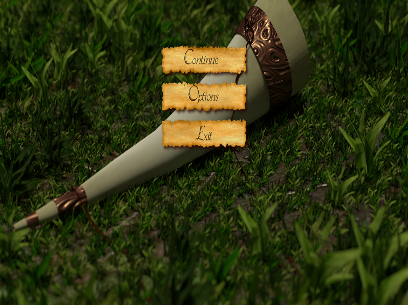
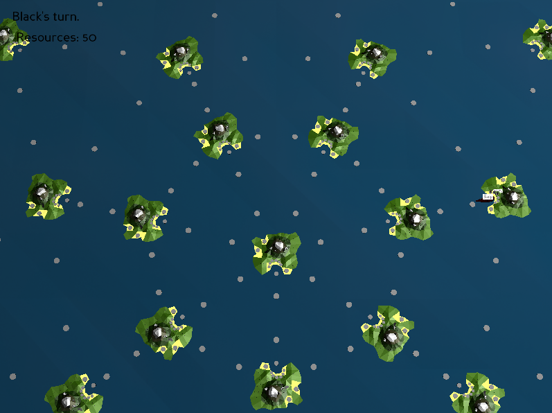
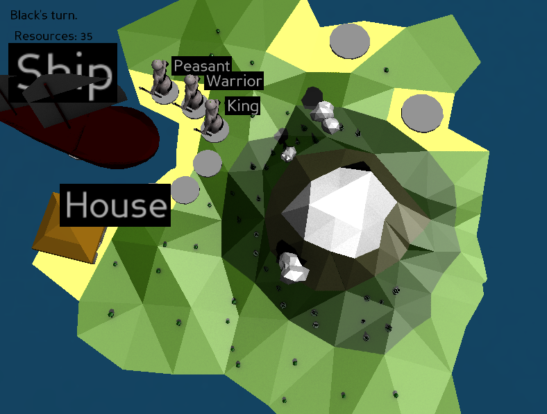
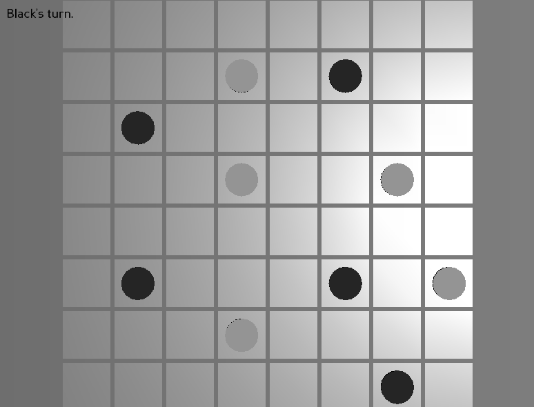

# comori
A python implementation of the Comori board game for an university project.

# What is comori

Comori is a board game in which two players (or potentially more, but we implement only two here) change turns to play on a big field with archipelago of 22 islands placed in a star-shaped form. Every player commands figures of 4 types:
* Peasants
* Warriors
* King (only one king for each player)
* Ships

Each of the three human-figures has it's own voice: peasants has the Voice of Creation, warriors the Voice of Destruction and the king has the Voice of Gevernance. The combinations voices form different songs, with which the player can build new buildings. There are 7 songs:
* Voice of Creation - Song of Birth
* Voice of Destruction - Song of Death
* Voice of Governance - Song of Reign
* Voice of Creation and Voice of Destruction - Song of Resistance
* Voice of Creation and Voice of Governance - Song of Ascent
* Voice of Destruction and Voice of Governance - Song of Tyranny
* Voice of Creation, Voice of Destruction and Voice of Gevernance - Song of the Mysteries

Each of the songs has three buildings that can be built with it (only the Song of the Mysteries has only one bulding associatet with it). This makes a total of 19 buildings, each with different effect.

There are 7 different objectives for winning in comori, but only one is active at a time. Players can change the objective by using one of the 7 songs at the central island. The 7 objectives are:
* Song of Birth - Collect a lot of resouces
* Song of Death - Kill the enemy' king
* Song of Reign - Conquer a lot of islands
* Song of Resistance - No one can win, while this objective is set
* Song of Ascent - Have made a prospering civillization: have built all buildings
* Song of Tyranny - Leave the enemy without a single island
* Song of the Mysteries - If you sing this song at the central island you swap your place with that of your enemy - everything he has becomes yours, and vice versa

Inner battles are fought over an inner abstract strategy game.

# Features

3D graphics.

Turn-based strategy game for two players.

TODO: Players can change the rules for winning.

Players can choose to build from a rich assortment of buildings.

# Images from the current state of the implementation

